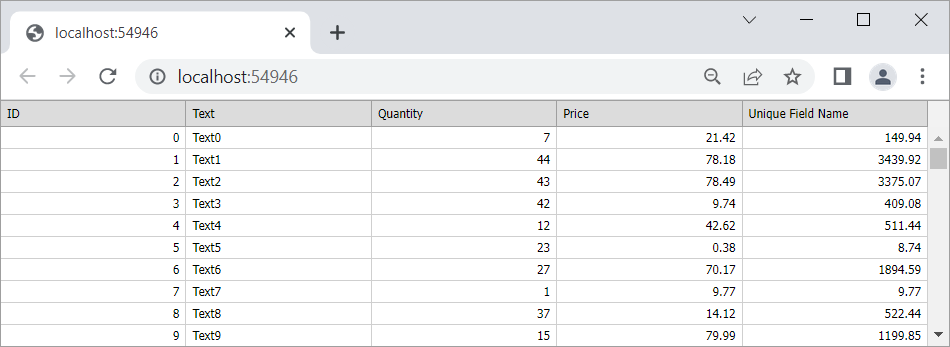

<!-- default badges list -->

[](https://supportcenter.devexpress.com/ticket/details/T830635)
[](https://docs.devexpress.com/GeneralInformation/403183)
<!-- default badges end -->
# Grid View for ASP.NET MVC - How to display the Grid View in full screen mode (100% width and height)
<!-- run online -->
**[[Run Online]](https://codecentral.devexpress.com/128551978/)**
<!-- run online end -->

This example demonstrates how to adjust the size of the [Grid View](https://docs.devexpress.com/AspNetMvc/8966/components/grid-view) extension to the size of the browser window.



## Overview

Follow the steps below to display the [GridViewExtension](https://docs.devexpress.com/AspNetMvc/DevExpress.Web.Mvc.GridViewExtension) in full screen mode.

### 1. Remove Margins

Set the `body` element's paddings and margins to zero.

```css  
body, html  {
    padding: 0;  
    margin: 0;  
}  
```

### 2. Add a Vertical Scroll Bar

Set the [VerticalScrollBarMode](https://documentation.devexpress.com/AspNet/DevExpress.Web.ASPxGridSettings.VerticalScrollBarMode.property) property to `Visible` to show the vertical scrollbar.

```razor
@Html.DevExpress().GridView(settings => {
    settings.Name = "grid";
    settings.Width = System.Web.UI.WebControls.Unit.Percentage(100);
    // ...
    settings.Settings.VerticalScrollBarMode = ScrollBarMode.Visible;
}).Bind(Model).GetHtml()
```

### 3. Set the Control's Height

Handle the Grid View extension's [Init](https://docs.devexpress.com/AspNet/DevExpress.Web.ClientSideEvents.Init) and [EndCallback](https://docs.devexpress.com/AspNet/DevExpress.Web.CallbackClientSideEventsBase.EndCallback) client-side events and call the [SetHeight](https://docs.devexpress.com/AspNet/js-ASPxClientControl.SetHeight(height)) method to adjust the Grid View's height during initialization and after each [callback](https://docs.devexpress.com/AspNetMvc/9052/common-features/callback-based-functionality).

```razor
@Html.DevExpress().GridView(settings => {
    settings.Name = "grid";
    settings.ClientSideEvents.Init = "OnInit";
    settings.ClientSideEvents.EndCallback = "OnEndCallback";
    // ...
}).Bind(Model).GetHtml()
```

```js
function OnInit(s, e) {
    AdjustSize();
    ASPxClientUtils.AttachEventToElement(window, "resize", function (evt) {
        AdjustSize();
    });
}
function OnEndCallback(s, e) {
    AdjustSize();
}
function AdjustSize() {
    var height = document.documentElement.clientHeight;
    grid.SetHeight(height);
}
```

## Files to Review

* [HomeController.cs](./CS/CS/Controllers/HomeController.cs) ([HomeController.vb](./VB/VB/Controllers/HomeController.vb))
* [Model.cs](./CS/CS/Models/Model.cs) ([Model.vb](./VB/VB/Models/Model.vb))
* [Index.cshtml](./CS/CS/Views/Home/Index.cshtml) ([Index.vbhtml](./VB/VB/Views/Home/Index.vbhtml))
* [TypedListDataBindingPartial.cshtml](./CS/CS/Views/Home/TypedListDataBindingPartial.cshtml) ([GridViewPartialView.vbhtml](./VB/VB/Views/Home/GridViewPartialView.vbhtml))
* [_Layout.cshtml](./CS/CS/Views/Shared/_Layout.cshtml) ([_rootLayout.vbhtml](./VB/VB/Views/Shared/_rootLayout.vbhtml))

## Documentation

- [Grid View - Concepts](https://docs.devexpress.com/AspNetMvc/14570/components/grid-view/concepts)

## More Examples

- [Grid View for ASP.NET Web Forms - How to display the Grid View in the full screen mode (100% width and height)](https://github.com/DevExpress-Examples/aspxgridview-full-screen-mode)
